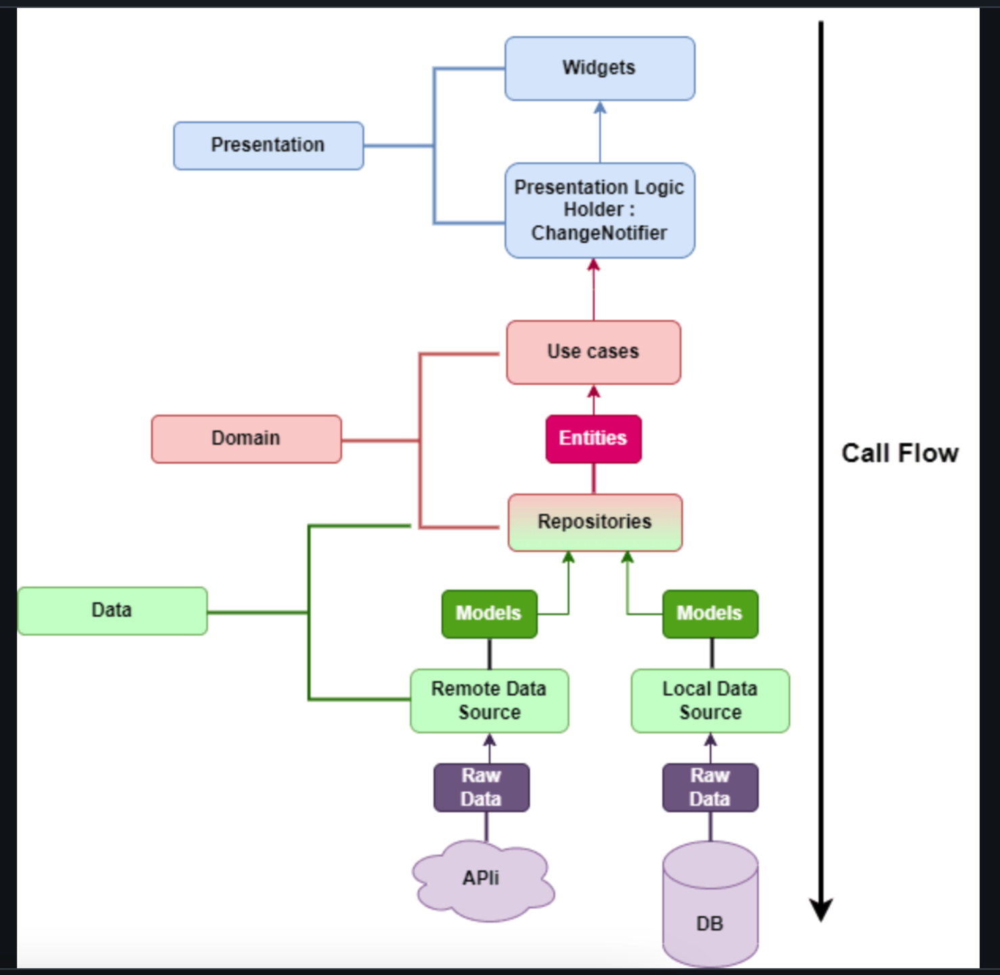

# `Clean template`

A new Flutter template.

## Getting Started

translation: 
dart run slang

Change app pakcage name

flutter pub run change_app_package_name:main com.package.name

Change app name

flutter pub run rename_app:main all="My App Name"

Change app icon

flutter pub run flutter_launcher_icons:main


I follow clean arch


in Core you can find data & domain as they are shared in app with local & remote datasources & repository & repositoryImp

on features folder you can find usecases which are the business logic & presentation layer

# to add firebase notification

1. add:

# firebase notification require 2 lib firebase_core & firebase_messaging

firebase_core: ^1.22.0

# found firebase_messaging: ^12.0.3 that is compatible

firebase_messaging: ^12.0.3 2. use terminal command to add the android & ios config :
flutterfire configure 3. copy pushes.json file to the new project to test ios simulator 4. add this code to main.dart

```WidgetsFlutterBinding.ensureInitialized();
  await Firebase.initializeApp(
    options: DefaultFirebaseOptions.currentPlatform,
  );
  // add firebase notification permission request
  FirebaseMessaging messaging = FirebaseMessaging.instance;
  NotificationSettings settings = await messaging.requestPermission(
    alert: true,
    announcement: false,
    badge: true,
    carPlay: false,
    criticalAlert: false,
    provisional: false,
    sound: true,
  );

  print('User granted permission: ${settings.authorizationStatus}');
```

5. execute the file:
   xcrun simctl push booted com.simplute.flutterNewTemplate pushes.json
